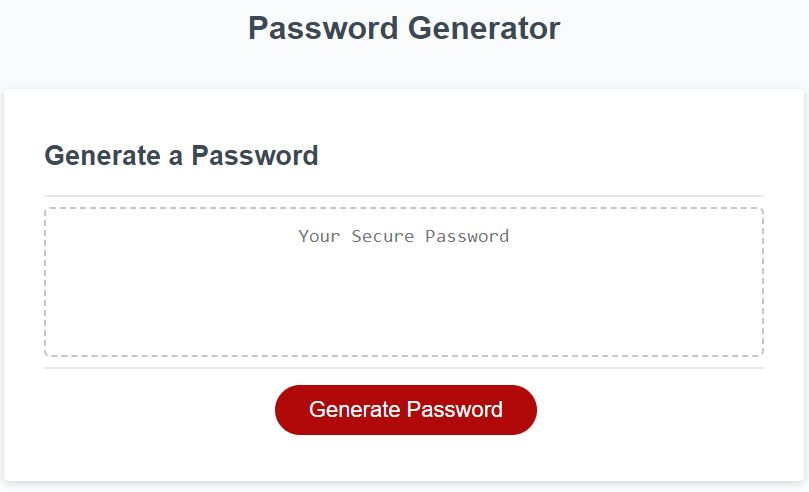

# Secure Password Generator
A simple password generator created by Jack Bittner @thejackbitt

## Features
This password generator takes 5 inputs from the user and turns it into a randomly generated, secure password.  Users can customize their password generation experience by specifying the length and allowance of character types.  You, as the user, can choose whether to enable lower case characters, upper case characters, special characters or numbers.  My generator does the rest.

## Under the Hood
The generator works by working character by character to randomly selecting a character set within the user's choices and then randomly select a character from within that set.  To follow best practices when creating a password, I programmed the generator to run a check on the previous character to insure no duplicates are created during the process.  The result is a secure password that you can use for any site without worrying about using an unsecure password.

## Screenshot
Below is a screenshot of the app itself:

## License
See license file for details.
